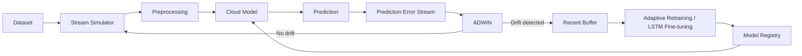

# Phát Hiện Drift Trong Hệ Thống IoT Bằng Online Learning

Đồ án môn học xây dựng một pipeline Machine Learning mô phỏng hệ thống giám sát an ninh IoT theo thời gian thực. Hệ thống phân loại traffic thành:

- `0`: benign/normal
- `1`: attack

Project tập trung vào bài toán **concept drift**: phân phối dữ liệu hoặc pattern tấn công thay đổi theo thời gian khiến mô hình đã huấn luyện bị suy giảm hiệu quả. ADWIN được dùng để theo dõi prediction error và kích hoạt retraining hoặc fine-tuning khi phát hiện drift.

Project hiện hỗ trợ:

- Synthetic IoT stream có nhiều giai đoạn drift.
- Static Random Forest baseline.
- ADWIN drift detection.
- Adaptive Random Forest với recent buffer.
- LSTM cho dữ liệu chuỗi thời gian.
- Adaptive LSTM fine-tuning theo window.
- Đánh giá theo từng stream window.
- So sánh hiệu năng và update cost.
- FastAPI model endpoint.
- Streamlit dashboard.
- Báo cáo Markdown tự động.

## 1. Mục Tiêu

Các mục tiêu chính của đồ án:

1. Phát hiện thời điểm model bắt đầu suy giảm trên IoT data stream.
2. Phát hiện sự thay đổi pattern tấn công, chẳng hạn từ DoS sang DDoS, Recon hoặc Mirai.
3. Dùng ADWIN để phát hiện drift dựa trên prediction error:
   - `0`: model dự đoán đúng.
   - `1`: model dự đoán sai.
4. Khi ADWIN phát hiện drift:
   - Retrain Random Forest bằng recent buffer.
   - Fine-tune LSTM bằng dữ liệu gần nhất.
5. So sánh static model và adaptive model.
6. Đo detection delay giữa actual drift point và detected drift point.
7. Đo số lần retrain, thời gian retrain và model version.
8. Phân tích trade-off giữa accuracy/F1 và update cost.
9. Mô phỏng cloud model storage bằng thư mục local.
10. Đồng bộ model, metrics và figures lên Azure Blob Storage.

## 2. Bài Toán Concept Drift Trong IoT

Trong hệ thống IoT, dữ liệu không cố định theo thời gian. Một mô hình được huấn luyện tốt tại thời điểm ban đầu có thể giảm chất lượng khi:

- Thiết bị mới xuất hiện.
- Hành vi người dùng thay đổi.
- Tỷ lệ normal/attack thay đổi.
- Pattern tấn công mới xuất hiện.
- Attacker thay đổi kỹ thuật để tránh model.
- Cấu hình mạng, protocol hoặc topology thay đổi.

Ví dụ:

- Giai đoạn đầu chủ yếu là benign traffic và một lượng nhỏ DoS.
- Sau đó tỷ lệ attack tăng và chuyển sang DDoS.
- Tiếp theo xuất hiện Recon hoặc Mirai với phân phối feature mới.
- Cuối cùng benign và attack trộn lẫn phức tạp hơn.

Nếu chỉ dùng static model, model không được cập nhật sau khi deploy. Adaptive model có thể dùng dữ liệu gần nhất để học lại khi drift được phát hiện.

## 3. Kiến Trúc Hệ Thống



Luồng xử lý:

1. Dataset được sắp xếp hoặc chia theo thời gian để mô phỏng stream.
2. Preprocessor chọn numeric features, xử lý missing values và scale dữ liệu.
3. Model hiện tại dự đoán normal hoặc attack.
4. Sau khi nhãn thật xuất hiện, hệ thống tạo prediction error.
5. ADWIN nhận lần lượt các error value.
6. Nếu ADWIN phát hiện thay đổi đáng kể:
   - Lấy dữ liệu gần nhất từ recent buffer.
   - Retrain Random Forest hoặc fine-tune LSTM.
   - Tăng model version.
   - Lưu model mới vào local model registry.
7. Metrics được lưu theo từng window để quan sát model thay đổi theo thời gian.

## 4. Các Thành Phần Chính

### Stream simulator

`src/drift_simulator.py` sinh synthetic IoT data gồm 4 giai đoạn drift. Dataset mặc định có:

- 50.000 dòng.
- 20 numeric features từ `feature_0` đến `feature_19`.
- `timestamp`.
- `attack_type`.
- `label_binary`.
- Actual drift points: `[12500, 25000, 37500]`.

### Preprocessing

`src/preprocessing.py` thực hiện:

- Tự phát hiện label column.
- Chuyển label thành binary.
- Loại metadata không phù hợp như timestamp hoặc IP dạng text.
- Giữ numeric features.
- Thay `inf/-inf` bằng missing value.
- Điền missing value bằng median.
- Scale bằng `StandardScaler`.

Scaler chỉ được fit trên train set. Stream/test set chỉ dùng `transform()` để tránh data leakage.

### Static model

Static baseline hiện dùng:

- `RandomForestClassifier`
- `n_estimators=100`
- `class_weight="balanced"`
- `n_jobs=-1`

Project cũng có `SGDClassifier(loss="log_loss")` để mở rộng sang `partial_fit`.

### ADWIN

ADWIN trong thư viện River theo dõi error stream. Khi phân phối error thay đổi đủ lớn, detector lưu detected drift index.

### Adaptive Random Forest

Adaptive Random Forest sử dụng recent buffer dạng FIFO. Khi drift xảy ra:

1. Lấy tối đa 5.000 dòng gần nhất.
2. Train Random Forest mới.
3. Tăng model version.
4. Lưu model dưới dạng:

```text
cloud_model_storage/adaptive_rf_v{version}.joblib
```

### LSTM

Tabular data được chuyển thành overlapping sequences:

```text
(samples, features)
        ↓
(sequences, timesteps, features)
```

Kiến trúc LSTM:

```text
LSTM(64)
Dropout(0.3)
Dense(32, activation="relu")
Dropout(0.2)
Dense(1, activation="sigmoid")
```

Compile configuration:

```text
optimizer = adam
loss = binary_crossentropy
metric = accuracy
```

### Adaptive LSTM

Stream được xử lý theo window. Với mỗi window:

1. Tạo sequence.
2. Dự đoán bằng model hiện tại.
3. Tính accuracy, precision, recall và F1.
4. Đưa prediction error vào ADWIN.
5. Nếu drift được phát hiện:
   - Lấy recent buffer.
   - Tạo sequence mới.
   - Fine-tune LSTM 3 epoch.
   - Lưu model version mới.

Model adaptive được lưu dưới dạng:

```text
cloud_model_storage/lstm_adaptive_v{version}.keras
```

## 5. Cấu Trúc Thư Mục

```text
iot-drift-online-learning/
├── api/
│   └── main.py
├── cloud_model_storage/
│   └── .gitkeep
├── dashboard/
│   └── app.py
├── data/
│   ├── raw/
│   │   ├── TON_IoT/
│   │   │   └── .gitkeep
│   │   └── CICIoT/
│   │       └── .gitkeep
│   ├── processed/
│   │   └── .gitkeep
│   └── synthetic/
│       └── .gitkeep
├── notebooks/
│   └── .gitkeep
├── outputs/
│   ├── figures/
│   │   └── .gitkeep
│   ├── metrics/
│   │   └── .gitkeep
│   └── logs/
│       └── .gitkeep
├── scripts/
│   ├── 00_generate_synthetic_data.py
│   ├── 01_prepare_data.py
│   ├── 02_train_static.py
│   ├── 03_run_stream_adwin.py
│   ├── 04_run_adaptive_static.py
│   ├── 05_train_lstm.py
│   ├── 06_run_adaptive_lstm.py
│   ├── 07_compare_models.py
│   ├── 08_generate_experiment_report.py
│   ├── 09_upload_models_to_azure.py
│   └── 09_upload_models_to_s3.py
├── src/
│   ├── __init__.py
│   ├── config.py
│   ├── data_loader.py
│   ├── preprocessing.py
│   ├── drift_simulator.py
│   ├── static_model.py
│   ├── lstm_model.py
│   ├── adwin_detector.py
│   ├── adaptive_trainer.py
│   ├── evaluation.py
│   ├── model_registry.py
│   ├── azure_storage.py
│   ├── aws_storage.py
│   └── utils.py
├── .env.example
├── .gitignore
├── PROGRESS.md
├── README.md
└── requirements.txt
```

Vai trò của các thư mục:

| Thư mục | Mục đích |
| --- | --- |
| `data/raw/` | Chứa dataset gốc TON_IoT và CICIoT |
| `data/processed/` | Chứa dữ liệu đã chuẩn hóa |
| `data/synthetic/` | Chứa synthetic dataset dùng để demo |
| `src/` | Chứa logic chính của pipeline |
| `scripts/` | Chứa các entrypoint chạy experiment |
| `cloud_model_storage/` | Mô phỏng cloud model registry |
| `outputs/metrics/` | Chứa CSV/JSON metrics |
| `outputs/figures/` | Chứa biểu đồ experiment |
| `outputs/logs/` | Chứa log runtime trong tương lai |
| `api/` | FastAPI prediction endpoint |
| `dashboard/` | Streamlit experiment dashboard |

## 6. Yêu Cầu Môi Trường

Khuyến nghị:

- Python 3.10 hoặc 3.11.
- RAM tối thiểu 8 GB.
- Có thể chạy bằng CPU.
- Windows, Linux hoặc macOS.

Các thư viện chính:

- pandas
- numpy
- scikit-learn
- matplotlib
- plotly
- river
- tensorflow
- joblib
- fastapi
- uvicorn
- streamlit
- boto3
- python-dotenv

Lưu ý: TensorFlow phiên bản mới trên native Windows chủ yếu chạy bằng CPU. Nếu cần GPU, có thể dùng WSL2 hoặc môi trường Linux phù hợp.

## 7. Cài Đặt

### Clone project

```bash
git clone <YOUR_REPOSITORY_URL>
cd iot-drift-online-learning
```

### Tạo virtual environment trên Windows

```powershell
python -m venv .venv
.venv\Scripts\Activate.ps1
```

Nếu PowerShell chặn activate script:

```powershell
Set-ExecutionPolicy -Scope Process -ExecutionPolicy Bypass
.venv\Scripts\Activate.ps1
```

### Tạo virtual environment trên macOS/Linux

```bash
python -m venv .venv
source .venv/bin/activate
```

### Cài dependencies

```bash
python -m pip install --upgrade pip
pip install -r requirements.txt
```

### Cấu hình môi trường

Project không yêu cầu `.env` để chạy pipeline local. Để sử dụng Azure Blob
Storage:

```bash
cp .env.example .env
```

Trên Windows:

```powershell
Copy-Item .env.example .env
```

Không commit `.env` hoặc credential thật lên GitHub.

Các biến Azure cần cấu hình:

```dotenv
AZURE_STORAGE_CONNECTION_STRING=
AZURE_BLOB_CONTAINER_NAME=iot-drift-models
```

Code không in connection string ra terminal. Nếu thiếu connection string,
container hoặc Azure SDK, thao tác cloud được bỏ qua với warning và pipeline
local vẫn tiếp tục.

## 8. Thứ Tự Chạy Demo

Chạy các command từ project root.

### Bước 1: Sinh synthetic dataset

```bash
python scripts/00_generate_synthetic_data.py
```

Output chính:

```text
data/synthetic/synthetic_iot_drift.csv
outputs/metrics/synthetic_drift_points.json
```

### Bước 2: Train static Random Forest

```bash
python scripts/02_train_static.py
```

Output chính:

```text
cloud_model_storage/static_random_forest.joblib
cloud_model_storage/preprocessor.joblib
outputs/metrics/static_model_metrics.json
outputs/metrics/static_window_metrics.csv
outputs/figures/static_f1_over_time.png
```

### Bước 3: Chạy ADWIN trên static model

```bash
python scripts/03_run_stream_adwin.py
```

Output chính:

```text
outputs/metrics/adwin_detected_drifts.json
outputs/metrics/adwin_detection_delay.csv
outputs/figures/adwin_error_rate_over_time.png
outputs/figures/adwin_f1_over_time.png
```

### Bước 4: Chạy Adaptive Random Forest

```bash
python scripts/04_run_adaptive_static.py
```

Output chính:

```text
cloud_model_storage/adaptive_rf_v0.joblib
cloud_model_storage/adaptive_rf_v{version}.joblib
cloud_model_storage/adaptive_rf_preprocessor.joblib
outputs/metrics/adaptive_static_window_metrics.csv
outputs/metrics/adaptive_static_retrain_log.csv
outputs/metrics/adaptive_static_summary.json
outputs/figures/static_vs_adaptive_f1.png
```

Nếu ADWIN không phát hiện drift thì không có model version mới và retrain log có thể chỉ chứa header.

### Bước 5: Train LSTM ban đầu

```bash
python scripts/05_train_lstm.py
```

Output chính:

```text
cloud_model_storage/lstm_initial.keras
cloud_model_storage/lstm_preprocessor.joblib
outputs/metrics/lstm_initial_metrics.json
outputs/figures/lstm_training_history.png
```

### Bước 6: Chạy Adaptive LSTM

```bash
python scripts/06_run_adaptive_lstm.py
```

Output chính:

```text
cloud_model_storage/lstm_adaptive_v{version}.keras
outputs/metrics/adaptive_lstm_window_metrics.csv
outputs/metrics/adaptive_lstm_retrain_log.csv
outputs/metrics/adaptive_lstm_detected_drifts.json
outputs/metrics/adaptive_lstm_summary.json
outputs/figures/adaptive_lstm_f1_over_time.png
outputs/figures/lstm_static_vs_adaptive.png
```

### Bước 7: So sánh các model

```bash
python scripts/07_compare_models.py
```

Output chính:

```text
outputs/metrics/model_comparison_summary.csv
outputs/metrics/model_comparison_summary.json
outputs/figures/compare_f1_over_time.png
outputs/figures/compare_accuracy_over_time.png
outputs/figures/compare_average_f1.png
outputs/figures/accuracy_vs_update_cost.png
```

### Bước 8: Tạo báo cáo tự động

```bash
python scripts/08_generate_experiment_report.py
```

Báo cáo được tạo tại:

```text
outputs/experiment_report.md
```

### Bước 9: Chạy dashboard

```bash
streamlit run dashboard/app.py
```

Mở:

```text
http://127.0.0.1:8501
```

Dashboard có các tab:

- Dataset Overview
- Static Model Performance
- ADWIN Drift Detection
- Adaptive Model
- Model Comparison
- Admin Pipeline

### Bước 10: Chạy API

```bash
uvicorn api.main:app --reload
```

Mở Swagger UI:

```text
http://127.0.0.1:8000/docs
```

Lưu ý: cú pháp Uvicorn phải có `:app`. Lệnh `uvicorn api.main --reload` thiếu tên FastAPI application và không phải command chuẩn cho project này.

## 9. Chạy Toàn Bộ Pipeline

Project có hai cách chạy:

1. Chạy từng script bằng terminal để dễ theo dõi và debug từng bước.
2. Chạy bằng tab **Admin Pipeline** trong Streamlit dashboard.

### Cách 1: Terminal

```bash
python scripts/00_generate_synthetic_data.py
python scripts/02_train_static.py
python scripts/03_run_stream_adwin.py
python scripts/04_run_adaptive_static.py
python scripts/05_train_lstm.py
python scripts/06_run_adaptive_lstm.py
python scripts/07_compare_models.py
python scripts/08_generate_experiment_report.py
streamlit run dashboard/app.py
```

Upload artifact lên Azure Blob Storage là bước tùy chọn:

```bash
python scripts/09_upload_models_to_azure.py
```

### Cách 2: Streamlit Admin Pipeline

Khởi động dashboard:

```bash
streamlit run dashboard/app.py
```

Mở tab **Admin Pipeline**. Tại đây có thể chạy từng script hoặc chọn
**Run Full Pipeline**. Full Pipeline hỗ trợ:

- `Include LSTM`: chạy thêm initial LSTM và adaptive LSTM.
- `Upload to Azure after completion`: upload models, metrics và figures sau khi
  các bước local hoàn tất.

Dashboard hiển thị command, thời gian bắt đầu/kết thúc, trạng thái, stdout,
stderr và file output quan trọng. Pipeline dừng tại bước đầu tiên bị lỗi.

Không public tab Admin Pipeline nếu dashboard được deploy lên internet, vì tab
này có quyền khởi chạy các tiến trình huấn luyện trên máy chủ.

Chạy API ở terminal khác:

```bash
uvicorn api.main:app --reload
```

## 10. Sử Dụng Dataset Thật

### TON_IoT

Đặt file TON_IoT vào:

```text
data/raw/TON_IoT/
```

Ví dụ:

```text
data/raw/TON_IoT/Train_Test_Network.csv
```

Load bằng:

```python
from src.data_loader import load_ton_iot_dataset

df = load_ton_iot_dataset("Train_Test_Network.csv")
```

### CICIoT

Đặt file CICIoT vào:

```text
data/raw/CICIoT/
```

Ví dụ:

```text
data/raw/CICIoT/part-00000.csv
```

Load bằng:

```python
from src.data_loader import load_cic_iot_dataset

df = load_cic_iot_dataset("part-00000.csv")
```

### Các bước tích hợp dataset thật

1. Đặt file vào đúng thư mục.
2. Cập nhật filename trong script experiment hoặc gọi loader với filename đúng.
3. Kiểm tra label column bằng `detect_label_column()`.
4. Nếu cần, truyền `label_col` cụ thể vào `create_binary_label()`.
5. Xác định timestamp column.
6. Sắp xếp và chia dữ liệu theo thời gian, không shuffle.
7. Chạy preprocessing.
8. Fit preprocessor chỉ trên train set.
9. Chạy static/adaptive experiment.

Ví dụ:

```python
from src.data_loader import load_ton_iot_dataset, time_based_split
from src.preprocessing import create_binary_label, clean_features, Preprocessor

df = load_ton_iot_dataset("Train_Test_Network.csv")
df = create_binary_label(df, label_col="label")

train_df, stream_df = time_based_split(
    df,
    train_ratio=0.6,
    timestamp_col="timestamp",
)

X_train, y_train, feature_names = clean_features(train_df)
X_stream, y_stream, _ = clean_features(stream_df)
X_stream = X_stream[feature_names]

preprocessor = Preprocessor()
X_train_scaled = preprocessor.fit_transform(X_train)
X_stream_scaled = preprocessor.transform(X_stream)
```

`scripts/01_prepare_data.py` hiện vẫn là bước cần hoàn thiện cho schema cụ thể của TON_IoT/CICIoT. Không nên giả định mọi phiên bản dataset có cùng tên label, timestamp hoặc feature columns.

## 11. Các Chỉ Số Đánh Giá

### Accuracy

Tỷ lệ tổng số dự đoán đúng:

```text
Accuracy = (TP + TN) / (TP + TN + FP + FN)
```

Accuracy dễ hiểu nhưng có thể gây hiểu nhầm nếu dataset mất cân bằng.

### Precision

Trong các mẫu model dự đoán là attack, precision cho biết tỷ lệ attack thật:

```text
Precision = TP / (TP + FP)
```

Precision cao giúp giảm false alarm.

### Recall

Trong các attack thật, recall cho biết model phát hiện được bao nhiêu:

```text
Recall = TP / (TP + FN)
```

Trong intrusion detection, recall thường rất quan trọng vì false negative có thể bỏ sót tấn công.

### F1-score

Trung bình điều hòa của precision và recall:

```text
F1 = 2 × Precision × Recall / (Precision + Recall)
```

F1 phù hợp khi cần cân bằng false positive và false negative.

### Detection delay

Số sample từ actual drift point đến detected drift point:

```text
Detection delay = detected drift point - actual drift point
```

Delay càng thấp thì hệ thống phản ứng càng nhanh.

### Retrain count

Số lần ADWIN kích hoạt retraining hoặc fine-tuning.

Retrain count quá cao có thể cho thấy:

- Detector quá nhạy.
- Model không ổn định.
- Drift xảy ra liên tục.
- Update cost lớn.

### Retrain time

Thời gian cần để train hoặc fine-tune model sau drift.

### Update cost

Update cost có thể gồm:

- Retraining time.
- CPU/GPU usage.
- Memory usage.
- Model storage.
- Network bandwidth khi upload model lên cloud.
- Downtime hoặc latency trong lúc đổi model.

Project hiện đo chủ yếu bằng retrain count và retrain time.

## 12. Kết Quả Demo Hiện Tại

Kết quả phụ thuộc phiên bản thư viện, random seed và môi trường chạy. Một lần chạy gần nhất cho kết quả:

| Model | Average Accuracy | Average Recall | Average F1 | Retrain Count | Update Time |
| --- | ---: | ---: | ---: | ---: | ---: |
| Static Random Forest | 0.9961 | 0.9918 | 0.9954 | 0 | 0.000 s |
| Adaptive Random Forest | 0.9961 | 0.9918 | 0.9954 | 0 | 0.000 s |
| Adaptive LSTM | 0.9627 | 0.9212 | 0.9572 | 1 | 2.890 s |

Adaptive LSTM experiment:

- Actual drift point: `37500`
- Detected drift point: `38008`
- Detection delay: `508` samples
- Static LSTM overall F1: khoảng `0.9489`
- Adaptive LSTM overall F1: khoảng `0.9561`
- Final window F1: khoảng `0.9962`

Random Forest đạt điểm rất cao trên synthetic data hiện tại, khiến error stream thay đổi chưa đủ mạnh để ADWIN kích hoạt adaptive retraining. Đây là hạn chế của kịch bản synthetic, không phải lỗi của detector.

## 13. Ý Nghĩa Kết Quả

### Static model

Static model không thay đổi sau khi deploy. Trong kịch bản drift đủ mạnh, hiệu năng thường giảm vì model vẫn sử dụng pattern cũ.

### Adaptive model

Adaptive model có thể phục hồi sau retraining hoặc fine-tuning bằng recent data. Kết quả Adaptive LSTM cho thấy recall và F1 tăng sau khi model được cập nhật.

### ADWIN

ADWIN giúp xác định thời điểm prediction error thay đổi đáng kể. Detector không cần biết trước vị trí drift thật khi chạy online.

### Trade-off

Adaptive learning không miễn phí:

- Có thể tăng accuracy, recall hoặc F1.
- Cần thời gian retraining.
- Cần lưu model version mới.
- Có thể tăng CPU/GPU và memory usage.
- Có thể phát sinh false alarm nếu detector quá nhạy.

Vì vậy, model tốt nhất không chỉ là model có accuracy cao nhất. Cần cân bằng:

- Chất lượng dự đoán.
- Detection delay.
- Tốc độ cập nhật.
- Chi phí tài nguyên.
- Độ ổn định của hệ thống.

## 14. FastAPI Model Endpoint

API tự chọn model trong `cloud_model_storage/` theo thứ tự:

1. Adaptive LSTM version mới nhất.
2. Adaptive Random Forest version mới nhất.
3. Static Random Forest.

Endpoints:

| Method | Endpoint | Mục đích |
| --- | --- | --- |
| GET | `/` | Thông tin project |
| GET | `/health` | Trạng thái API và model active |
| GET | `/models` | Danh sách model local |
| POST | `/predict` | Dự đoán một record |
| POST | `/predict_batch` | Dự đoán nhiều record |

Ví dụ request:

```json
{
  "feature_0": 0.1,
  "feature_1": 0.2,
  "feature_2": 0.3,
  "feature_3": 0.4,
  "feature_4": 0.5,
  "feature_5": 0.6,
  "feature_6": 0.7,
  "feature_7": 0.8,
  "feature_8": 0.9,
  "feature_9": 1.0,
  "feature_10": 0.1,
  "feature_11": 0.2,
  "feature_12": 0.3,
  "feature_13": 0.4,
  "feature_14": 0.5,
  "feature_15": 0.6,
  "feature_16": 0.7,
  "feature_17": 0.8,
  "feature_18": 0.9,
  "feature_19": 1.0
}
```

Ví dụ response:

```json
{
  "prediction": 0,
  "label": "normal",
  "model_name": "Adaptive LSTM",
  "model_version": 1,
  "confidence": 0.9999
}
```

LSTM cần một chuỗi nhiều timestep. Với request đơn lẻ, API hiện lặp/pad record để tạo sequence đủ độ dài. Đây là giải pháp demo, chưa phải stateful production inference.

## 15. Dashboard

Dashboard đọc trực tiếp các file trong `outputs/metrics/` và `cloud_model_storage/`.

Các chức năng:

- Xem tổng quan synthetic dataset.
- Xem phân phối normal/attack.
- Xem phân phối attack type.
- Xem static model metrics theo window.
- Xem ADWIN detected drift và detection delay.
- Chuyển giữa Adaptive Random Forest và Adaptive LSTM.
- Xem retraining log.
- So sánh model.
- Xem trade-off F1/accuracy và update cost.
- Chạy từng script bằng tab Admin Pipeline.
- Chạy Full Pipeline có hoặc không có LSTM.
- Upload artifact lên Azure sau khi pipeline hoàn tất.
- Xem trạng thái các output quan trọng và log stdout/stderr.

Nếu file output chưa tồn tại, dashboard hiển thị warning và tiếp tục chạy.

Admin Pipeline chỉ sử dụng danh sách command cố định trong source code, không
cho phép nhập shell command tùy ý. Connection string và secret trong environment
được che trước khi log được hiển thị.

### Reset demo và chạy lại từ đầu

Trong tab **Admin Pipeline**, khu vực **Demo Reset Tools** dùng khi cần:

- Xóa kết quả của lần demo trước để trình bày pipeline từ trạng thái ban đầu.
- Chạy lại experiment với output/model mới.
- Kiểm tra rõ script nào tạo ra từng artifact.

Nên bấm **Backup Current Results** trước khi reset. Dashboard copy `outputs/`,
`cloud_model_storage/` và `data/synthetic/` vào:

```text
demo_backups/run_YYYYMMDD_HHMMSS/
```

Thư mục `demo_backups/` chỉ lưu local và đã bị `.gitignore` chặn.

Để reset:

1. Chọn `outputs/`, `cloud_model_storage/` và/hoặc synthetic CSV/JSON.
2. Chọn **I understand this will delete generated demo files**.
3. Nhập chính xác `RESET`.
4. Bấm **Reset Demo Outputs**.

Reset không xóa source code, dataset trong `data/raw/`, `.env`, tài liệu project
hoặc dữ liệu đã upload lên Azure Blob Storage. Các thư mục output/model cần
thiết được tự động tạo lại.

Sau khi reset thành công, chọn **Include LSTM** nếu cần và bấm
**Run Full Pipeline From Scratch**. Không đóng dashboard trong lúc pipeline
đang chạy; LSTM có thể mất vài phút.

## 16. Báo Cáo Tự Động

Script:

```bash
python scripts/08_generate_experiment_report.py
```

Đọc các metrics:

```text
outputs/metrics/static_model_metrics.json
outputs/metrics/adwin_detection_delay.csv
outputs/metrics/adaptive_static_summary.json
outputs/metrics/adaptive_lstm_summary.json
outputs/metrics/model_comparison_summary.csv
```

Tạo:

```text
outputs/experiment_report.md
```

Báo cáo gồm:

- Tổng quan thực nghiệm.
- Dataset.
- Static model.
- ADWIN.
- Adaptive Random Forest.
- Adaptive LSTM.
- Detection delay.
- Model comparison.
- Trade-off.
- Kết luận tự động.
- Link tới các biểu đồ trong `outputs/figures/`.

## 17. Model Registry Và Cloud Storage

Model luôn được lưu local trước trong:

```text
cloud_model_storage/
```

Model được version hóa:

```text
adaptive_rf_v1.joblib
adaptive_rf_v2.joblib
lstm_adaptive_v1.keras
lstm_adaptive_v2.keras
```

Cloud storage chính của project là **Azure Blob Storage**.

### Tạo Azure Storage Account

1. Đăng nhập [Azure Portal](https://portal.azure.com/).
2. Tìm **Storage accounts** và chọn **Create**.
3. Chọn subscription, resource group và region phù hợp.
4. Đặt tên storage account duy nhất, dùng chữ thường và số.
5. Với project môn học, có thể dùng Standard performance và LRS redundancy.

Hướng dẫn chính thức:
[Create an Azure Storage Account](https://learn.microsoft.com/azure/storage/common/storage-account-create).

### Tạo Blob Container

1. Mở storage account vừa tạo.
2. Chọn **Data storage → Containers**.
3. Chọn **+ Container**.
4. Đặt tên `iot-drift-models`.
5. Giữ anonymous access ở trạng thái private.

Tên container phải viết thường. Hướng dẫn:
[Manage blob containers](https://learn.microsoft.com/azure/storage/blobs/blob-containers-portal).

### Lấy Connection String

Trong storage account, mở **Security + networking → Access keys**, chọn
**Show keys**, sau đó sao chép **Connection string** của một key.

Connection string chứa account key và phải được xem như secret. Không chụp màn
hình, không ghi vào source code và không commit lên GitHub. Trong production nên
chuyển sang Managed Identity hoặc `DefaultAzureCredential`.

### Cấu hình `.env`

Tạo `.env` local từ `.env.example`, sau đó điền:

```dotenv
AZURE_STORAGE_CONNECTION_STRING=your_connection_string
AZURE_BLOB_CONTAINER_NAME=iot-drift-models
```

File `.env` đã bị `.gitignore` chặn. Tuyệt đối không commit file này.

### Upload toàn bộ artifact lên Azure

```bash
python scripts/09_upload_models_to_azure.py
```

Script upload:

- `cloud_model_storage/*` vào `models/`.
- `outputs/metrics/*` vào `metrics/`.
- `outputs/figures/*` vào `figures/`.

Cấu trúc blob:

```text
models/static_random_forest.joblib
models/preprocessor.joblib
models/adaptive_rf_v1.joblib
models/lstm_initial.keras
models/lstm_adaptive_v1.keras
metrics/static_model_metrics.json
metrics/model_comparison_summary.csv
figures/static_vs_adaptive_f1.png
```

Nếu thiếu connection string, container hoặc thư viện Azure, script in warning
và dừng an toàn. Model local và kết quả experiment không bị ảnh hưởng.

### Kiểm tra trên Azure Portal

Mở **Storage account → Data storage → Containers → iot-drift-models**, sau đó
kiểm tra các prefix `models/`, `metrics/` và `figures/`.

Module `src/azure_storage.py` hỗ trợ upload, download, list blob, list model và
lấy model mới nhất theo `last_modified`.

### AWS S3 tương thích cũ

Các file `src/aws_storage.py` và `scripts/09_upload_models_to_s3.py` vẫn được
giữ để tương thích. Azure Blob Storage là lựa chọn được ưu tiên trong README và
luồng demo mới.

## 18. An Toàn Khi Đưa Lên GitHub

Project đã cấu hình `.gitignore` để không commit:

- `.env`
- Python cache
- Virtual environment
- Dataset raw/processed
- Synthetic CSV
- Outputs
- Logs
- Local model storage
- Joblib/Pickle/Keras/H5 artifacts

Không lưu trực tiếp:

- Azure Storage connection string
- AWS Access Key
- AWS Secret Key
- API token
- Password
- Private endpoint

Chỉ commit `.env.example` với giá trị rỗng hoặc placeholder.

## 19. Hạn Chế

1. Synthetic drift chưa phản ánh đầy đủ độ phức tạp của traffic IoT thật.
2. Random Forest hiện hoạt động quá tốt trên synthetic data nên ADWIN không trigger adaptive RF.
3. Với split 60/40, stream hiện chỉ chứa drift point `37500`; hai drift trước nằm trong train.
4. LSTM online trong project thực chất là fine-tuning theo window, chưa phải online learning từng sample.
5. Adaptive LSTM đã giữ context xuyên biên window, nhưng effective update latency sau khi kết thúc window chưa được đo riêng.
6. Azure Blob đã được tích hợp nhưng chưa kiểm thử với Storage Account thật.
7. API LSTM phải pad dữ liệu khi request chưa đủ timestep.
8. Hệ thống cần nhãn thật sau prediction để tạo error stream cho ADWIN.
9. Trong hệ thống thực tế, nhãn có thể đến chậm hoặc không có sẵn.
10. TON_IoT và CICIoT có nhiều phiên bản/schema khác nhau; cần mapping riêng.
11. `scripts/01_prepare_data.py` chưa hoàn thiện cho dataset thật.
12. Chưa có automated test suite đầy đủ.
13. Dependencies hiện chưa pin version, nên kết quả có thể thay đổi nhẹ giữa môi trường.
14. Chưa đánh giá resource usage chi tiết như RAM, CPU, GPU hoặc inference latency.

## 20. Hướng Phát Triển

### Cloud deployment

- Deploy FastAPI lên Azure App Service hoặc Azure Container Apps.
- Dùng Managed Identity thay cho connection string khi deploy.
- Tích hợp Azure Machine Learning Model Registry.
- AWS S3/SageMaker và GCP Vertex AI vẫn là các hướng thay thế.

### Real-time IoT streaming

- Dùng MQTT để nhận telemetry từ IoT devices.
- Dùng Apache Kafka làm event stream.
- Dùng AWS IoT Core.
- Dùng Spark Structured Streaming hoặc Flink.

### Drift detectors

Thử thêm:

- DDM
- EDDM
- Page-Hinkley
- KSWIN
- HDDM

Sau đó so sánh:

- Detection delay.
- False alarm.
- Missed drift.
- Memory cost.
- Processing time.

### Online models

Thử thêm:

- Hoeffding Tree.
- Adaptive Random Forest của River.
- Online Logistic Regression.
- Naive Bayes online.
- LearnPPNSE hoặc ensemble online.

### Bài toán nâng cao

- Multi-class attack classification.
- Unknown attack detection.
- Anomaly detection không giám sát.
- Delayed-label learning.
- Continual learning.
- Federated learning cho nhiều IoT gateway.
- Model rollback nếu retraining làm hiệu năng giảm.
- Drift explanation và feature-distribution monitoring.

## 21. Troubleshooting

### Không tìm thấy synthetic dataset

Chạy:

```bash
python scripts/00_generate_synthetic_data.py
```

### Không tìm thấy static model

Chạy:

```bash
python scripts/02_train_static.py
```

### Không tìm thấy initial LSTM

Chạy:

```bash
python scripts/05_train_lstm.py
```

### ADWIN không phát hiện drift

Điều này không nhất thiết là lỗi. Các nguyên nhân có thể gồm:

- Model vẫn dự đoán tốt sau drift.
- Prediction error thay đổi chưa đủ mạnh.
- `delta` chưa phù hợp.
- Synthetic drift tác động lên feature nhưng không làm decision boundary thay đổi đủ lớn.

Có thể thử:

- Tăng mức độ feature shift.
- Đảo hoặc thay đổi decision boundary.
- Tăng label noise sau drift.
- Thay đổi attack ratio mạnh hơn.
- Thử detector khác.

### TensorFlow chạy chậm

- Giảm epochs.
- Tăng batch size nếu đủ RAM.
- Giảm số dòng.
- Giảm LSTM units.
- Dùng WSL2/Linux nếu cần GPU.

### Dashboard thiếu dữ liệu

Chạy pipeline từ script `00` đến `08` trước khi mở dashboard.

### API báo không có model

Chạy ít nhất một trong các script:

```bash
python scripts/02_train_static.py
python scripts/05_train_lstm.py
python scripts/06_run_adaptive_lstm.py
```

## 22. Trạng Thái Project

Các phần đã hoạt động:

- Synthetic stream generation.
- Data loading và preprocessing.
- Static Random Forest.
- Window evaluation.
- ADWIN detector.
- Adaptive Random Forest pipeline.
- Initial LSTM.
- Adaptive LSTM.
- Model comparison.
- Experiment report.
- FastAPI endpoint.
- Streamlit dashboard.
- Azure Blob Storage upload/download utilities.
- Azure bulk upload script cho models, metrics và figures.
- Legacy AWS S3 compatibility utilities.

Các phần cần tiếp tục:

- Chuẩn hóa TON_IoT/CICIoT thật.
- Hoàn thiện `scripts/01_prepare_data.py`.
- Automated tests.
- Production stream integration.

Xem tiến độ chi tiết tại [PROGRESS.md](PROGRESS.md).

## 23. Tài Liệu Kết Quả

Sau khi chạy đầy đủ pipeline:

- Báo cáo: `outputs/experiment_report.md`
- Metrics: `outputs/metrics/`
- Figures: `outputs/figures/`
- Models: `cloud_model_storage/`

Các thư mục này được giữ local và không đưa lên GitHub theo cấu hình mặc định.

## 24. Tóm Tắt

Project minh họa một pipeline hoàn chỉnh cho drift detection trong IoT:

```text
IoT stream
→ prediction
→ error monitoring
→ ADWIN drift detection
→ adaptive retraining/fine-tuning
→ versioned model storage
→ evaluation and visualization
```

Kết quả cho thấy adaptive learning có thể giúp model phục hồi sau khi pattern dữ liệu thay đổi. Tuy nhiên, lợi ích về accuracy/F1 luôn cần được đánh giá cùng detection delay và chi phí cập nhật. Đây là nền tảng phù hợp để phát triển tiếp thành đồ án với dataset TON_IoT/CICIoT thật hoặc triển khai trên cloud.
